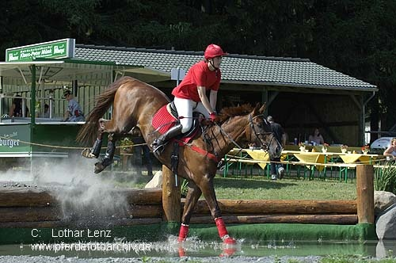
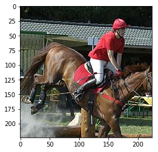
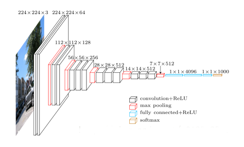
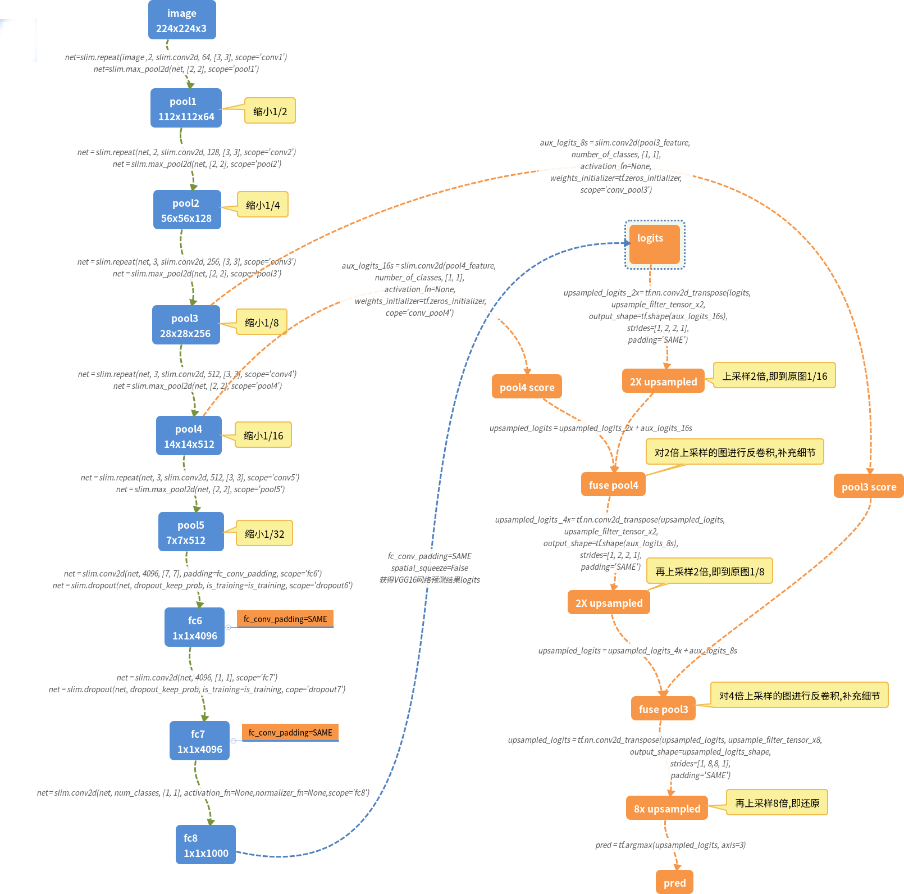
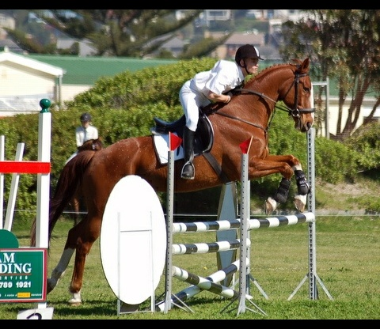
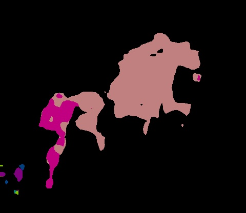
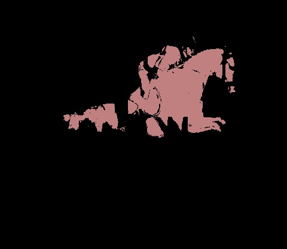

# 基于VGG16模型的FCN-8s语义分割

## 数据集
使用Pascal2 VOC2012的数据中，语义分割部分的数据作为作业的数据集。

VOC网址：http://host.robots.ox.ac.uk/pascal/VOC/voc2012/

VOC数据集目录结构如下：
```
├── local
│   ├── VOC2006
│   └── VOC2007
├── results
│   ├── VOC2006
│   │   └── Main
│   └── VOC2007
│       ├── Layout
│       ├── Main
│       └── Segmentation
├── VOC2007
│   ├── Annotations
│   ├── ImageSets
│   │   ├── Layout
│   │   ├── Main
│   │   └── Segmentation
│   ├── JPEGImages
│   ├── SegmentationClass
│   └── SegmentationObject
├── VOC2012
│   ├── Annotations
│   ├── ImageSets
│   │   ├── Action
│   │   ├── Layout
│   │   ├── Main
│   │   └── Segmentation
│   ├── JPEGImages
│   ├── SegmentationClass
│   └── SegmentationObject
└── VOCcode
```

[VOC2012下载] (http://host.robots.ox.ac.uk/pascal/VOC/voc2012/VOCtrainval_11-May-2012.tar)。

数据集划分位于/VOC2012/ImageSets/Segmentation中，分为训练图片train.txt 1464张图片对应文件存放在 /JPEGImages 中，后缀是 .jpg; 和语义分割标签图片val.txt 1449张图片对应文件存放在 /SegmentationClass 中，后缀是 .png.

## 数据处理

需要将训练和标签图片转化为tf.record格式:

语义分割标签用颜色来标志不同的物体，该数据集中共有20种不同的物体分类，以1～20的数字编号，加上编号为0的背景分类，该数据集中共有21种分类。编号与颜色的对应关系如下：
```py
# class
classes = ['background', 'aeroplane', 'bicycle', 'bird', 'boat',
           'bottle', 'bus', 'car', 'cat', 'chair', 'cow', 'diningtable',
           'dog', 'horse', 'motorbike', 'person', 'potted plant',
           'sheep', 'sofa', 'train', 'tv/monitor']

# RGB color for each class
colormap = [[0, 0, 0], [128, 0, 0], [0, 128, 0], [128, 128, 0], [0, 0, 128],
            [128, 0, 128], [0, 128, 128], [128, 128, 128], [64, 0, 0], [192, 0, 0],
            [64, 128, 0], [192, 128, 0], [64, 0, 128], [192, 0, 128],
            [64, 128, 128], [192, 128, 128], [0, 64, 0], [128, 64, 0],
            [0, 192, 0], [128, 192, 0], [0, 64, 128]]
```

### 标签索引

需要将每个每一个类别的RGB值映射到一个索引, 通过一一对应的关系,就能将标签图片变成一个和原来图片一样尺寸,但是却只有一个通道的矩阵.

```py
import cv2
import numpy as np

# 每个像素点有 0 ~ 255 的选择，RGB 三个通道
cm2lbl = np.zeros(256**3)

for i, cm in enumerate(colormap):
	# 按RGB顺序
    cm2lbl[(cm[0] * 256 + cm[1]) * 256 + cm[2]] = i

def image2label(im):
    # data = im.astype('int32').asnumpy()这么写会报错:
    # AttributeError: 'numpy.ndarray' object has no attribute 'asnumpy'
    data = im.astype('int32')
    # opencv读入的图片按BRG顺序
    idx = (data[:,:,2]*256+data[:,:,1])*256+data[:,:,0]
    
    return np.array(cm2lbl[idx])

# 验证例子
img_label = cv2.imread('./VOC2012/SegmentationClass/2007_000392.png')
label = image2label(img_label)
ids=label[label>0]
ids=list(set(ids))
for i in range(len(ids)):
    print('label %d : %s' % (ids[i],classes[ids[i]]))
    
```
label 13 : horse

label 15 : person

原图



标签


### feature_dict

生成的tf.record至少需要训练图片和标签图片信息,
```py
feature_dict = {
        'image/height': int64_feature(height), 
        # 标签图片高,训练无用的feature
        'image/width': int64_feature(width), 
        # 标签图片宽,训练无用的feature
        'image/filename': bytes_feature(image_name), 
        # 图片名,注意要encode,训练无用的feature
        'image/encoded':  bytes_feature(encoded_data), 
        # 训练图片
        'image/label': bytes_feature(encoded_label), 
        # 标签图片
        'image/format':bytes_feature('jpeg'.encode('utf8')), 
        # 训练无用的feature
    }
```

### Crop

训练集和标签集中的图片大小不完全一致(同一个图片的训练和标签大小相同), 在训练中batch的话,要保证所有图片大小一致.

但是,不能采用rsize的办法让缩放图片大小, 因为标签图片一旦缩放了,就没法在像素级上和训练图片完全匹配了.

采用tf.random_crop对图片进行剪切可以保证 图片和标签完全匹配.

试验
```py
import tensorflow as tf
import matplotlib.image as img
import time
import matplotlib.pyplot as plt
%matplotlib inline

sess = tf.InteractiveSession()
image = img.imread('./VOC2012/JPEGImages/2007_000392.jpg')

reshaped_image = tf.cast(image,tf.float32)
size = tf.cast(tf.shape(reshaped_image).eval(),tf.int32)
height = 224
width = 224

distorted_image = tf.random_crop(image,[height,width,3],seed=int(time.time()))
print(tf.shape(reshaped_image).eval())
print(tf.shape(distorted_image).eval())

fig = plt.figure()
fig1 = plt.figure()
ax = fig.add_subplot(111)
ax1 = fig1.add_subplot(111)
ax.imshow(sess.run(tf.cast(reshaped_image,tf.uint8)))
ax1.imshow(sess.run(tf.cast(distorted_image,tf.uint8)))
plt.show()

```
[332 500   3]
[224 224   3]

Crop后的图片



## FCN-8s模型

全连接的VGG16网络结构:


FCN(全卷积神经网络)是在VGG16网络基础上, 将全连接层改为卷积层进而用于语义分割,FC论文参https://arxiv.org/abs/1411.4038

FCN-8s的实现如下:



FCN-8s就是先将最后的结果通过转置卷积扩大 2 倍(上采样2x)后和 pool4 的结果相加，再通过转置卷积扩大 2 倍(上采样2x)后和 pool3 的结果相加，最后通过转置卷积扩大 8 倍(上采样8x)得到与原图相同尺寸得的结果.

关键的代码如下:
```py

# logits:将VGG16网络中全连接改为卷积得到的结果
with slim.arg_scope(vgg.vgg_arg_scope()):
    logits, end_points = vgg.vgg_16(image_tensor,
                                num_classes=number_of_classes,
                                is_training=is_training_placeholder,
                                spatial_squeeze=False,
                                fc_conv_padding='SAME')

downsampled_logits_shape = tf.shape(logits)
img_shape = tf.shape(image_tensor)

# Calculate the ouput size of the upsampled tensor
# The shape should be batch_size X width X height X num_classes
upsampled_logits_shape = tf.stack([
                              downsampled_logits_shape[0],
                              img_shape[1],
                              img_shape[2],
                              downsampled_logits_shape[3]])

对pool4之后的网络施加1x1的卷积,得到pool4后的结果aux_logits_16s
pool4_feature = end_points['vgg_16/pool4']
with tf.variable_scope('vgg_16/fc8'):
    aux_logits_16s = slim.conv2d(pool4_feature, 
                              number_of_classes, [1, 1],
                              activation_fn=None,
                              weights_initializer=tf.zeros_initializer,
                              scope='conv_pool4')

# 2倍上采样tf变量
upsample_filter_np_x2 = bilinear_upsample_weights(2,  # upsample_factor,
                              number_of_classes)
upsample_filter_tensor_x2 = tf.Variable(upsample_filter_np_x2, 
                              name='vgg_16/fc8/t_conv_x2')
# 对logits进行2倍上采样
upsampled_logits = tf.nn.conv2d_transpose(logits, 
                              upsample_filter_tensor_x2,
                              output_shape=tf.shape(aux_logits_16s),
                              strides=[1, 2, 2, 1],
                              padding='SAME')
# 与pool4后的结果相加
upsampled_logits = upsampled_logits + aux_logits_16s

# 对pool3之后的网络施加1x1的卷积,得到pool3后的结果aux_logits_8s
pool3_feature = end_points['vgg_16/pool3']
with tf.variable_scope('vgg_16/fc8'):
    aux_logits_8s = slim.conv2d(pool3_feature, 
                              number_of_classes, [1, 1],
                              activation_fn=None,
                              weights_initializer=tf.zeros_initializer,
                              scope='conv_pool3')

# 对第一次2X上采样后的网络进行再次2x上采样
# output_shape为pool3之后的网络施加1x1卷积的输出aux_logits_8s
upsampled_logits = tf.nn.conv2d_transpose(upsampled_logits, 
                              upsample_filter_tensor_x2,
                              output_shape=tf.shape(aux_logits_8s),
                              strides=[1, 2, 2, 1],
                              padding='SAME')

# 经过2次2X上采样的网络 + pool3后之卷积网络
upsampled_logits = upsampled_logits + aux_logits_8s

# 8X上采样
# upsample_factor为8
upsample_filter_np_x8= bilinear_upsample_weights(8,
                                                   number_of_classes)

# 8x上采样后,得到与原图一样大小的图
upsample_filter_tensor_x8 = tf.Variable(upsample_filter_np_x8, name='vgg_16/fc8/t_conv_x8')
upsampled_logits = tf.nn.conv2d_transpose(upsampled_logits, 
                              upsample_filter_tensor_x8,
                              output_shape=upsampled_logits_shape,
                              strides=[1, 8, 8, 1],
                              padding='SAME')
```
## tinymind运行结果

tinymind模型的地址为:https://www.tinymind.com/nukiel/w10-fcn8x

代码托管到github上:https://github.com/Leikun0303/AI100-W10

设置的参数为:
```sh
learning_rate:  0.0001
batch_size: 16
output_dir: /output
checkpoint_path: /data/nukiel/w10-datav2/vgg_16.ckpt
dataset_train: /data/nukiel/w10-datav2/fcn_train.record
dataset_val: /data/nukiel/w10-datav2/fcn_val.record
max_steps: 1500
```
tinymind运行log：
```sh
...
2018-05-17 14:58:44,905 - DEBUG - train.py:318 - [9.18] imgs/s
2018-05-17 14:59:01,847 - DEBUG - train.py:316 - step 1470 Current Loss: 110.2160415649414 
2018-05-17 14:59:01,848 - DEBUG - train.py:318 - [9.44] imgs/s
2018-05-17 14:59:19,011 - DEBUG - train.py:316 - step 1480 Current Loss: 67.49158477783203 
2018-05-17 14:59:19,011 - DEBUG - train.py:318 - [9.32] imgs/s
2018-05-17 14:59:35,946 - DEBUG - train.py:316 - step 1490 Current Loss: 78.44097137451172 
2018-05-17 14:59:35,946 - DEBUG - train.py:318 - [9.45] imgs/s
2018-05-17 14:59:53,065 - DEBUG - train.py:316 - step 1500 Current Loss: 77.05095672607422 
2018-05-17 14:59:53,065 - DEBUG - train.py:318 - [9.35] imgs/s
...
```

原图



标签


预测



CRF之后的预测

